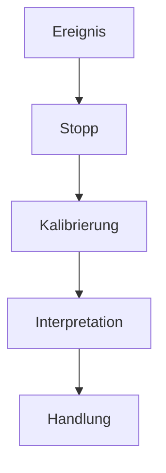

# RPF — Referenzpunkt-Funktion

**Sprachen:** Deutsch · [English](README.en.md)

Ein hypothetisches Architekturmodell zur metakognitiven Selbstkalibrierung und zur Verarbeitung von Informationskonflikten unter Unsicherheit.

> Nicht sofort fragen: „Welche Aussage ist wahr?“, sondern zuerst:
>
> **„Auf welcher Ebene entsteht der scheinbare Widerspruch?“**

## Grundidee

Die Referenzpunkt-Funktion (RPF) fügt zwischen Ereignis und Reaktion einen prüfbaren Referenzpunkt ein. An diesem Punkt werden Zuständigkeit, Referenzrahmen, interne Konfidenz, externe Evidenz und mögliche Handlungsfolgen getrennt betrachtet.



Die RPF ist kein Wahrheitsautomat. Sie ist ein Meta-Verfahren, das vorschnelle Modellrevisionen und Reaktionen unter Unsicherheit bremsen und nachvollziehbarer machen soll.

## Archivstatus

| Bestandteil | Kennung | Status |
| --- | --- | --- |
| RPF-Kernspezifikation | `ARCHIVED_SPEC_1.2` | `FROZEN DRAFT · IDLE` |
| RPF-X/IR-Reflexivitätsmodul | `ARCHIVED_RPF-X_IR_0.2` | `FROZEN DRAFT · IDLE` |
| Empirische Validierung | — | nicht durchgeführt |
| Klinische Validierung | — | nicht durchgeführt |

Die archivierten Fassungen werden nicht rückwirkend verändert. Inhaltliche Weiterentwicklungen benötigen eine neue, dokumentierte Revision. Empirische Befunde werden getrennt von den Archivfassungen geführt.

## Aktueller Entwicklungsstand

Die **nicht-normative experimentelle Python-Implementierung 0.3** enthält
einen deterministischen Validator für A1–A4 und P1–P4, einen strikten
versionierten JSON-Parser, ein maschinenlesbares JSON-Schema und die
Kommandozeile `rpf`. Sie bewertet die Nachvollziehbarkeit und Regelkonformität
einer bereitgestellten Prozessbeschreibung — nicht die Wahrheit ihres
Ergebnisses.

Die Bewertungssemantik und ihre Grenzen stehen in der
[Validator-Implementierung 0.2](docs/VALIDATOR_IMPLEMENTATION_0.2.md). Die neue
öffentliche Schnittstelle beschreibt
[JSON und CLI 0.3](docs/JSON_CLI_0.3.md). Weitere Etappen enthält die
[deutsche Roadmap](ROADMAP.md); eine vollständige englische Fassung steht in
der [English roadmap](ROADMAP.en.md).

## Experimenteller Python-Prototyp

Das Repository enthält ein abhängigkeitenfreies, typisiertes und
unveränderliches Ein-/Ausgabedatenmodell sowie den ausführbaren
`evaluate`-Kern. Er bildet Kompetenz, `C_i`, `C_e`, Referenzrahmen, Hypothesen,
Terminierungsgrenzen, Zeithorizonte, Handlungsoptionen und Restunsicherheit als
getrennte Strukturen ab und erzeugt für jede Regel einen erklärbaren Status mit
stabilen Reason-Codes.

Direkter Lauf des öffentlichen Wetterbeispiels:

```bash
python -m pip install --no-deps .
rpf validate examples/weather-input-0.2.json
```

Das mitgelieferte Eingabeschema kann ebenfalls maschinenlesbar ausgegeben
werden:

```bash
rpf schema
```

Minimale Verwendung mit einem konstruierten `ValidatorInput`:

```python
from rpf_validator import evaluate, to_json

result = evaluate(case)
print(to_json(result))
```

Lokaler Testlauf ab Python 3.11:

```bash
python -m unittest discover -s tests -v
```

Die Struktur folgt der
[Validator-Operationalisierung](docs/VALIDATOR_OPERATIONALIZATION.md).

## Dokumentation

| Dokument | Inhalt |
| --- | --- |
| [RPF v1.2](docs/ARCHIVED_SPEC_1.2.md) | archivierte Kernspezifikation |
| [RPF-X/IR v0.2](docs/ARCHIVED_RPF-X_IR_0.2.md) | Reflexivität und introspektive Reaktivität |
| [Zustandsautomat](docs/STATE_MACHINE.md) | Zustände, Übergänge und Abbruchpfade |
| [Axiome](docs/AXIOMS.md) | Kompetenz, duale Kalibrierung, Terminierung und Zeitbezug |
| [Referenzrahmenklassifikation](docs/REFERENCE_FRAME_CLASSIFICATION.md) | Einordnung scheinbarer Widersprüche |
| [Trennung von Fähigkeit und Kalibrierung](docs/CAPABILITY_CALIBRATION_SEPARATION.md) | experimentelles Implementierungsprinzip für den Validator |
| [Validator-Operationalisierung](docs/VALIDATOR_OPERATIONALIZATION.md) | Eingaben, Regeln, Status, Reason-Codes und Mindesttests für A1–A4 und P1–P4 |
| [Validator-Implementierung 0.2](docs/VALIDATOR_IMPLEMENTATION_0.2.md) | ausführbarer Regelvertrag, Annahmen, Prüfstand und Grenzen |
| [JSON und CLI 0.3](docs/JSON_CLI_0.3.md) | Parser, JSON-Schema, Kommandozeile, Exit-Codes und öffentliches Beispiel |
| [Python-Paket](src/rpf_validator) | Datenmodell, Parser und deterministischer Evaluator |
| [Wetterbeispiel](examples/weather-input-0.2.json) | direkt ausführbarer neutraler JSON-Referenzfall |
| [Koinzidenz-Interpretation](docs/TRANSFER_CASE_COINCIDENCE_INTERPRETATION.md) | synthetische `WARN`-Fixture zur Trennung von Bedeutung, Konfidenz, Evidenz und Kausalität |
| [Kontext-Rückkopplung und rückgespiegelte Begehrlichkeit](docs/TRANSFER_CASE_REFLECTED_DESIRE.md) | synthetische `WARN`-Fixture zur Trennung von äußerem Reiz, wahrgenommener Norm, Defizit und eigenem Wunsch |
| [Loop-Collapse-Transferfall](docs/TRANSFER_CASE_LOOP_COLLAPSE.md) | zwei nicht-klinische Negativ-Fixtures für Kompetenz-Gate und nachgelagerte Regelmechanik |
| [Eingabe-JSON-Schema](src/rpf_validator/schemas/rpf-validator-input-0.2.schema.json) | maschinenlesbarer Eingabevertrag |
| [KI-Agenten-Transferfallstudie](docs/TRANSFER_CASE_HUGGING_FACE_INCIDENT.md) | nicht-normative RPF-These zum OpenAI-/Hugging-Face-Sicherheitsvorfall |
| [Glossar](docs/GLOSSARY.md) | Begriffe und Symbole |
| [Entwicklungsroadmap](ROADMAP.md) | geplante experimentelle Python-Implementierung |
| [Redaktionelle Provenienz](PROVENANCE.md) | Herkunft, Rekonstruktionsgrenzen und Archivregeln |
| [Hinweise und Grenzen](DISCLAIMER.md) | Forschungs- und Nutzungshinweise |

## Ein neutraler Kurzfall

Zwei Wetterdienste melden für denselben Nachmittag unterschiedliche Regenwahrscheinlichkeiten. Die RPF behandelt dies nicht sofort als logischen Widerspruch. Sie prüft zunächst unter anderem:

1. Verwenden beide Dienste denselben Ort und Zeithorizont?
2. Sind Aktualisierungszeitpunkt, Datenbasis und Modell verschieden?
3. Handelt es sich um Messung, Prognose oder sprachliche Vereinfachung?
4. Wie belastbar sind interne Einschätzung (`C_i`) und externe Evidenz (`C_e`)?
5. Welche Handlung bleibt über mehrere Zeithorizonte sinnvoll und verhältnismäßig?

Das Ergebnis kann lauten: keine globale Wissensrevision, Unsicherheit ausdrücklich beibehalten und eine kostengünstige robuste Handlung wählen.

Eine getrennte [Transferfallstudie](docs/TRANSFER_CASE_HUGGING_FACE_INCIDENT.md)
prüft außerdem, ob RPF als begriffliche Linse für Referenzpunkt-Instabilität in
zieloptimierenden KI-Agenten dienen könnte. Sie ist ausdrücklich keine
Validierung des Modells.

Der [nicht-klinische Loop-Collapse-Transferfall](docs/TRANSFER_CASE_LOOP_COLLAPSE.md)
zeigt mit zwei ausführbaren JSON-Fixtures, warum eine beeinträchtigte
Selbstbewertung bei A1 delegiert werden muss, während ein getrenntes, extern
dokumentiertes Mechanikszenario Kalibrierungs-, Terminierungs- und
Reversibilitätssignale sichtbar halten kann. Er trifft keine medizinische oder
psychologische Aussage.

Der neue
[nicht-klinische Koinzidenz-Transferfall](docs/TRANSFER_CASE_COINCIDENCE_INTERPRETATION.md)
prüft einen anderen Grenzfall: Eine Beobachtung darf subjektiv bedeutsam
bleiben, ohne dass Auffälligkeit als Konfidenz oder externe Evidenz für eine
Kausalbehauptung ausgegeben wird.

Der ergänzende
[Transferfall zur Kontext-Rückkopplung](docs/TRANSFER_CASE_REFLECTED_DESIRE.md)
verfolgt den möglichen Folgeschritt von erhöhter Aufmerksamkeit über eine
wahrgenommene kollektive Präferenz bis zu Defizit-Zuschreibung, zugeschriebenem
eigenem Wunsch und Handlungsimpuls. Ein bewusst niedrig gewichtetes und ein
sozial folgenreicheres Beispiel zeigen dieselbe Inferenzform, ohne ihre Inhalte
gleichzusetzen oder eine persönliche Lebenssituation zu unterstellen.

## Öffentliche Ergebnisbeispiele

| Szenario | Führende Regelspur | Ergebnis |
| --- | --- | --- |
| [Wetterkonflikt](examples/weather-input-0.2.json) | keine ausgelöste Regel | `PASS` |
| [Koinzidenz-Interpretation](examples/coincidence-interpretation-input-0.2.json) | P1 · `REFERENCE_FRAME_AMBIGUOUS` | `WARN` |
| [Rückgespiegelte Begehrlichkeit](examples/reflected-desire-input-0.2.json) | P1 · `REFERENCE_FRAME_AMBIGUOUS` | `WARN` |
| [Loop-Collapse-Selbstbewertung](examples/loop-collapse-self-input-0.2.json) | A1 · `COMPETENCE_INSUFFICIENT` | `DELEGATE` |
| [Loop-Collapse-Mechanik](examples/loop-collapse-external-input-0.2.json) | A3/P3 · erreichte Abbruchgrenzen | `STOP` |

`NO_REFERENCE` ist bereits durch Unit-Tests abgedeckt; eine vollständige
öffentliche Fixture für diesen Status steht noch aus. Die Statuswerte bewerten
den deklarierten Prozess, nicht die Wahrheit des jeweiligen Szenarios.

## Grenzen

RPF ist ein konzeptioneller und empirisch nicht validierter Entwurf. Das Modell ist insbesondere:

- kein medizinisches oder psychotherapeutisches Verfahren,
- kein Diagnoseinstrument,
- kein Ersatz für fachliche Expertise oder belastbare Evidenz,
- keine Garantie für richtige Interpretation oder richtige Entscheidungen.

## Autorenschaft

**Konzept und Autorenschaft:** Björn · frenetik.B

**Redaktionelle und strukturelle Unterstützung:** ChatGPT · OpenAI

**Reihe:** Casa Causalis Research Notes

## Lizenz

© 2026 Björn · frenetik.B.

Dokumentation und Diagramme stehen unter [Creative Commons Attribution-NonCommercial-ShareAlike 4.0 International](LICENSE.md) (`CC BY-NC-SA 4.0`). Bearbeitungen müssen als solche gekennzeichnet werden. Die archivierten Kennungen dürfen nicht für veränderte Fassungen verwendet werden.

Der experimentelle Python-Code, die zugehörigen Tests, das technische
JSON-Schema, die Beispiel-Fixtures und mit einer `Apache-2.0`-SPDX-Kennung
versehenen technischen Konfigurationsdateien stehen separat unter der
[Apache License 2.0](LICENSE-CODE). Diese Softwarelizenz verändert die Lizenz
der Dokumentation nicht.

## English documentation

Eine eigenständig lesbare englische Projektübersicht steht in
[README.en.md](README.en.md) zur Verfügung.
