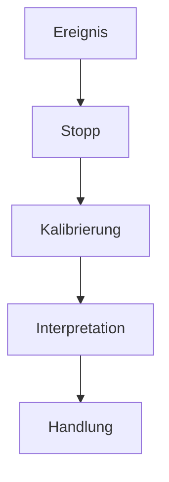

# RPF — Referenzpunkt-Funktion

**Sprachen:** Deutsch · [English](README.en.md)

Ein hypothetisches Architekturmodell zur metakognitiven Selbstkalibrierung und zur Verarbeitung von Informationskonflikten unter Unsicherheit.

> Nicht sofort fragen: „Welche Aussage ist wahr?“, sondern zuerst:
>
> **„Auf welcher Ebene entsteht der scheinbare Widerspruch?“**

## Grundidee

Die Referenzpunkt-Funktion (RPF) fügt zwischen Ereignis und Reaktion einen prüfbaren Referenzpunkt ein. An diesem Punkt werden Zuständigkeit, Referenzrahmen, interne Konfidenz, externe Evidenz und mögliche Handlungsfolgen getrennt betrachtet.

Die RPF ist kein Wahrheitsautomat. Sie ist ein Meta-Verfahren, das vorschnelle Modellrevisionen und Reaktionen unter Unsicherheit bremsen und nachvollziehbarer machen soll.

## Archivstatus

| Bestandteil | Kennung | Status |
| --- | --- | --- |
| RPF-Kernspezifikation | `ARCHIVED_SPEC_1.2` | `FROZEN DRAFT · IDLE` |
| RPF-X/IR-Reflexivitätsmodul | `ARCHIVED_RPF-X_IR_0.2` | `FROZEN DRAFT · IDLE` |
| Empirische Validierung | — | nicht durchgeführt |
| Klinische Validierung | — | nicht durchgeführt |

Die archivierten Fassungen werden nicht rückwirkend verändert. Inhaltliche Weiterentwicklungen benötigen eine neue, dokumentierte Revision. Empirische Befunde werden getrennt von den Archivfassungen geführt.

## Nächste Zielstellung

Als nächster Entwicklungsschritt ist eine **nicht-normative experimentelle
Python-Implementierung** geplant. Der erste Meilenstein soll ein
deterministischer Axiom-Validator werden, der die Nachvollziehbarkeit und
Regelkonformität eines Prüfprozesses bewertet — nicht die Wahrheit seines
Ergebnisses.

Die geplanten Etappen, Grenzen und offenen Entscheidungen stehen in der
[deutschen Roadmap](ROADMAP.md) und der [English roadmap](ROADMAP.en.md).

## Dokumentation

| Dokument | Inhalt |
| --- | --- |
| [RPF v1.2](docs/ARCHIVED_SPEC_1.2.md) | archivierte Kernspezifikation |
| [RPF-X/IR v0.2](docs/ARCHIVED_RPF-X_IR_0.2.md) | Reflexivität und introspektive Reaktivität |
| [Zustandsautomat](docs/STATE_MACHINE.md) | Zustände, Übergänge und Abbruchpfade |
| [Axiome](docs/AXIOMS.md) | Kompetenz, duale Kalibrierung, Terminierung und Zeitbezug |
| [Referenzrahmenklassifikation](docs/REFERENCE_FRAME_CLASSIFICATION.md) | Einordnung scheinbarer Widersprüche |
| [Trennung von Fähigkeit und Kalibrierung](docs/CAPABILITY_CALIBRATION_SEPARATION.md) | experimentelles Implementierungsprinzip für den Validator |
| [Validator-Operationalisierung](docs/VALIDATOR_OPERATIONALIZATION.md) | Eingaben, Regeln, Status, Reason-Codes und Mindesttests für A1–A4 und P1–P4 |
| [KI-Agenten-Transferfallstudie](docs/TRANSFER_CASE_HUGGING_FACE_INCIDENT.md) | nicht-normative RPF-These zum OpenAI-/Hugging-Face-Sicherheitsvorfall |
| [Glossar](docs/GLOSSARY.md) | Begriffe und Symbole |
| [Entwicklungsroadmap](ROADMAP.md) | geplante experimentelle Python-Implementierung |
| [Redaktionelle Provenienz](PROVENANCE.md) | Herkunft, Rekonstruktionsgrenzen und Archivregeln |
| [Hinweise und Grenzen](DISCLAIMER.md) | Forschungs- und Nutzungshinweise |

## Ein neutraler Kurzfall

Zwei Wetterdienste melden für denselben Nachmittag unterschiedliche Regenwahrscheinlichkeiten. Die RPF behandelt dies nicht sofort als logischen Widerspruch. Sie prüft zunächst unter anderem:

1. Verwenden beide Dienste denselben Ort und Zeithorizont?
2. Sind Aktualisierungszeitpunkt, Datenbasis und Modell verschieden?
3. Handelt es sich um Messung, Prognose oder sprachliche Vereinfachung?
4. Wie belastbar sind interne Einschätzung (`C_i`) und externe Evidenz (`C_e`)?
5. Welche Handlung bleibt über mehrere Zeithorizonte sinnvoll und verhältnismäßig?

Das Ergebnis kann lauten: keine globale Wissensrevision, Unsicherheit ausdrücklich beibehalten und eine kostengünstige robuste Handlung wählen.

Eine getrennte [Transferfallstudie](docs/TRANSFER_CASE_HUGGING_FACE_INCIDENT.md)
prüft außerdem, ob RPF als begriffliche Linse für Referenzpunkt-Instabilität in
zieloptimierenden KI-Agenten dienen könnte. Sie ist ausdrücklich keine
Validierung des Modells.

## Grenzen

RPF ist ein konzeptioneller und empirisch nicht validierter Entwurf. Das Modell ist insbesondere:

- kein medizinisches oder psychotherapeutisches Verfahren,
- kein Diagnoseinstrument,
- kein Ersatz für fachliche Expertise oder belastbare Evidenz,
- keine Garantie für richtige Interpretation oder richtige Entscheidungen.

## Autorenschaft

**Konzept und Autorenschaft:** Björn · frenetik.B

**Redaktionelle und strukturelle Unterstützung:** ChatGPT · OpenAI

**Reihe:** Casa Causalis Research Notes

## Lizenz

© 2026 Björn · frenetik.B.

Dokumentation und Diagramme stehen unter [Creative Commons Attribution-NonCommercial-ShareAlike 4.0 International](LICENSE.md) (`CC BY-NC-SA 4.0`). Bearbeitungen müssen als solche gekennzeichnet werden. Die archivierten Kennungen dürfen nicht für veränderte Fassungen verwendet werden.

## English documentation

Eine eigenständig lesbare englische Projektübersicht steht in
[README.en.md](README.en.md) zur Verfügung.
