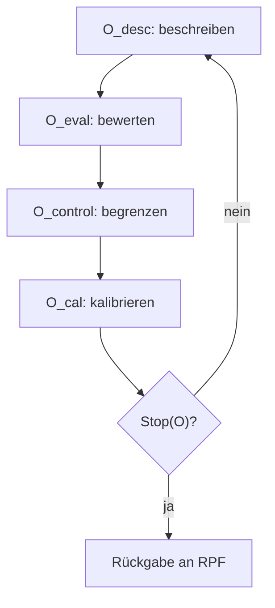

# `ARCHIVED_RPF-X_IR_0.2`

## RPF-X/IR — Reflexivitätsmodul für introspektive Reaktivität

| Feld | Wert |
| --- | --- |
| Version | RPF-X/IR v0.2 |
| Archivkennung | `ARCHIVED_RPF-X_IR_0.2` |
| Status | `FROZEN DRAFT · IDLE` |
| Eingefroren | 23. Juli 2026 |
| Öffentliche Redaktion | 13. August 2026 |
| Validierung | empirisch und klinisch nicht validiert |

> **Archivhinweis:** Diese Datei ist die redaktionell normalisierte öffentliche
> Darstellung des am 23. Juli 2026 eingefrorenen Modulstands. Sie ist keine
> wortgetreue Transkription früherer Arbeitsgespräche. Rekonstruktionsgrenzen
> sind in [PROVENANCE.md](../PROVENANCE.md) offengelegt.

## 1. Zweck

RPF-X bezeichnet das Reflexivitätsmodul der RPF. Der Zusatz `IR` steht für **introspektive Reaktivität**.

Das Modul behandelt den Fall, dass Beobachtung nicht neutral bleibt: Das Beobachten, Bewerten oder Kontrollieren eines eigenen Prozesses kann dessen Zustand verändern. Diese Beobachtungsreaktivität wird als potenziell nichtlinear modelliert. Eine detaillierte nichtlineare Funktionsform wurde im eingefrorenen Stand nicht festgelegt und wird hier nicht nachträglich erfunden.

## 2. Grundannahme

Mehr Beobachtung erzeugt nicht automatisch mehr verwertbare Information. Nach einem Punkt können Wiederholung, Aktivierung oder Belastung schneller zunehmen als der Informationsgewinn.

RPF-X/IR trennt deshalb vier kanonische Beobachtungsoperatoren:

| Operator | Redaktionelle Funktionsbeschreibung |
| --- | --- |
| `O_desc` | den beobachteten Zustand beschreiben, ohne ihn bereits abschließend zu bewerten |
| `O_eval` | Informationswert, Unsicherheit und mögliche Verzerrung der Beobachtung bewerten |
| `O_control` | Intensität, Wiederholung und Dauer der weiteren Beobachtung begrenzen |
| `O_cal` | Ergebnis und Beobachtungswirkung für den RPF-Hauptprozess kalibrieren |

Die Operatornamen gehören zum archivierten Stand. Die vorstehenden Kurzbeschreibungen sind die öffentliche redaktionelle Auslegung ihrer Funktion.

## 3. Beobachtungsschleife



Die Schleife darf nur erneut durchlaufen werden, wenn ein relevanter Informationsgewinn zu erwarten ist und die Kontrollgrenzen nicht erreicht sind.

## 4. Terminierung

Die bestätigte Abbruchregel lautet:

```text
Stop(O) ⇔ (ΔI_O ≤ ε_O) ∨ (n_O ≥ n_{O,max}) ∨ (A_O ≥ θ_A)
```

Dabei bezeichnet:

- `ΔI_O` den marginalen Informationsgewinn der letzten Beobachtungsiteration,
- `ε_O` die minimale relevante Informationsschwelle,
- `n_O` die Zahl der Beobachtungswiederholungen,
- `n_{O,max}` die maximale Wiederholungszahl,
- `A_O` die durch Beobachtung ausgelöste Aktivierung oder Belastung,
- `θ_A` deren festgelegte Abbruchschwelle.

Sobald eine der Bedingungen erfüllt ist, endet die Beobachtungsschleife. Ein weiterer Durchlauf darf nicht allein mit dem Wunsch nach vollständiger Gewissheit begründet werden.

## 5. Kopplung an RPF v1.2

RPF-X/IR ersetzt die Kernspezifikation nicht. Das Modul liefert Metadaten an die RPF zurück:

- Beschreibung des beobachteten Zustands,
- geschätzter Informationszuwachs,
- mögliche Beobachtungsreaktivität,
- Aktivierungs- oder Belastungsniveau,
- Terminierungsgrund,
- verbleibende Unsicherheit.

Diese Informationen fließen in `DELTA_EVAL`, `ADAPTIVE_VAL` und gegebenenfalls `OUTPUT_INTERFACE` ein.

## 6. Invarianten

1. Beobachtung gilt nicht allein deshalb als korrekt, weil sie wiederholt wurde.
2. Beschreibung (`O_desc`) und Bewertung (`O_eval`) bleiben unterscheidbar.
3. Die Beobachtungsschleife besitzt harte Kontroll- und Abbruchbedingungen.
4. Steigende Aktivierung kann einen Abbruch rechtfertigen, selbst wenn subjektiv noch Klärungsbedarf besteht.
5. Das Modul darf keine unendliche Reflexionsschleife erzeugen.
6. Verbleibende Unsicherheit ist ein zulässiger Rückgabewert.

## 7. Grenzen

RPF-X/IR v0.2 ist eine Architekturhypothese. Die Operatoren und Schwellen sind nicht empirisch kalibriert. Das Modul ist kein klinisches Monitoring-Verfahren und keine Empfehlung zur gesteigerten Selbstbeobachtung.

## 8. Änderungsregel

`ARCHIVED_RPF-X_IR_0.2` bleibt eingefroren. Jede Änderung an Operatoren, Kopplung oder Terminierung benötigt eine neue Versionskennung.
