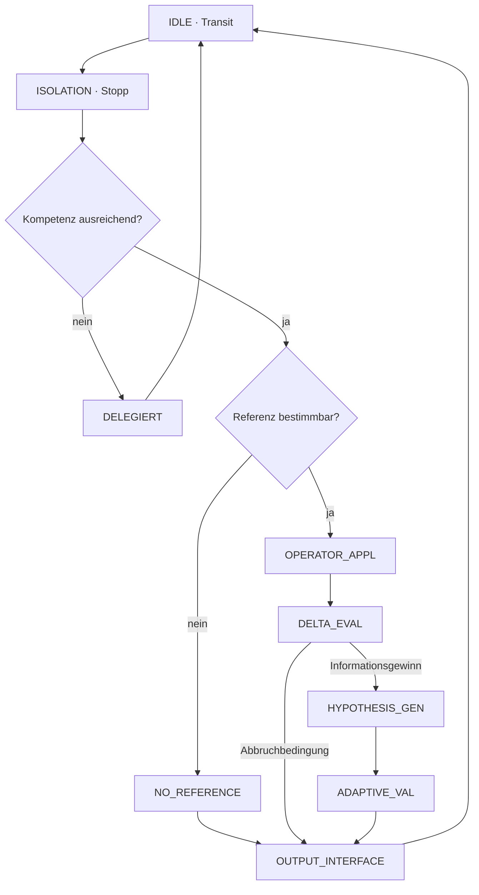

# RPF-Zustandsautomat

> **Experimentelle Runtime:** Die nicht-normative ausführbare Umsetzung dieses
> Zustandsraums ist zweisprachig in
> [RPF-Zustandsautomat 0.4](STATE_MACHINE_RUNTIME_0.4.md) dokumentiert. Sie
> verändert den hier dargestellten eingefrorenen Konzeptstand nicht.

Dieses Dokument visualisiert den in RPF v1.2 bestätigten Zustandsraum. Es ergänzt die Archivfassung, ersetzt sie jedoch nicht.

## Zustände

| Zustand | Aufgabe | Zulässiger Ausgang |
| --- | --- | --- |
| `IDLE` | Bereitschaft ohne aktive RPF-Prüfung | neues Ereignis → `ISOLATION` |
| `ISOLATION` | Ereignis von erster automatischer Interpretation trennen | Kompetenzprüfung |
| Kompetenzprüfung | Passung zum Problemraum bestimmen | weiter oder `DELEGIERT` |
| Referenzprüfung | belastbaren Referenzpunkt beziehungsweise Referenzrahmen suchen | `OPERATOR_APPL` oder `NO_REFERENCE` |
| `OPERATOR_APPL` | epistemische Operatoren auf Information und Kontext anwenden | `DELTA_EVAL` |
| `DELTA_EVAL` | Informationszuwachs und Grenzen prüfen | weiter oder terminieren |
| `HYPOTHESIS_GEN` | mehrere prüfbare Einordnungen erzeugen | `ADAPTIVE_VAL` |
| `ADAPTIVE_VAL` | Folgen und Nutzen über Zeithorizonte bewerten | `OUTPUT_INTERFACE` |
| `OUTPUT_INTERFACE` | Ergebnis, Unsicherheit und Handlung ausgeben | `IDLE` |
| `DELEGIERT` | externe Expertise oder Evidenz anfordern | Abschluss / `IDLE` |
| `NO_REFERENCE` | fehlende Referenz ausdrücklich anzeigen | Abschluss über `OUTPUT_INTERFACE` |

## Übergangsregeln

1. Ohne Kompetenzprüfung erfolgt keine epistemische Operatoranwendung.
2. Ohne belastbaren Referenzpunkt wird keine Ersatzgewissheit erzeugt.
3. `DELTA_EVAL` prüft vor jeder weiteren Iteration die Terminierungsregel.
4. `ADAPTIVE_VAL` folgt auf Hypothesenerzeugung und nicht auf eine ungeprüfte Erstdeutung.
5. Jeder Pfad kehrt nach Ausgabe, Delegation oder Abbruch zu `IDLE` zurück.

## Ergebniszustände

Die Architektur erlaubt mehrere gleichwertig gültige Abschlüsse:

- interpretieren und handeln,
- vorläufig handeln und Unsicherheit erhalten,
- Urteil aussetzen,
- externe Expertise oder Evidenz einholen,
- ohne Referenzpunkt terminieren.
