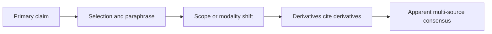

# Transfer case: Source Echo and Reference-Frame Drift

**Languages:** [Deutsch](TRANSFER_CASE_SOURCE_ECHO.md) · English

## Status and purpose

This transfer case examines how several published texts can create the
appearance of repeated confirmation even though they depend on the same
evidence root for one particular claim. It also separates source count from
the semantic fidelity of those sources.

The case is a synthetic, non-normative application of RPF. It changes neither
the frozen core specification nor the current JSON contract. The executable
fixture only tests whether a **declared** reference-frame ambiguity is retained.
The validator does not research sources, compare texts semantically, or infer
dependency graphs.

## The unit of analysis is a claim

Source independence is not a fixed property of two documents. It is a relation
with respect to a precisely named claim `Q` and the evidence dimension under
consideration.

For `Q1`, five texts may depend on the same primary observation. For `Q2`, the
same texts may contribute independent data, methods, or analyses. Neither a
shared topic nor distinct documents therefore establishes independence.

| Question | Possible dimension of independence |
| --- | --- |
| Were new observations collected? | data |
| Was the same observation analysed independently? | analysis |
| Was a different measurement method used? | method |
| Is only background or context added? | context |
| Was the statement derived from another text? | provenance |

The compact rule is:

> A source is not “independent overall.” It can only be independent **for a
> named claim and a named dimension**.

## Three distinct mechanisms

### 1. Source Echo

Several texts reproduce a claim with substantial fidelity but ultimately rely
on the same evidence root for that claim. Publication count increases; the
number of independent observations does not.

### 2. Semantic Drift

The shared origin is known, but selection, compression, and paraphrase change
epistemic properties of the claim, for example:

- possibility becomes certainty,
- association becomes causation,
- a small or limited sample is generalized,
- conditions, time, or residual uncertainty disappear,
- description becomes advice, warning, or norm.

### 3. Apparent Consensus

Source Echo and Semantic Drift interact. Later texts cite derivatives instead
of the evidence root and use stronger wording. Repetition then appears both as
confirmation and as a stronger claim.



## Synthetic example

The fixture contains no real-world factual claim. Its fictional evidence root
states, in substance:

> In a small exploratory sample, `X` under condition `Z` was associated with
> `Y`; causality was not tested.

A possible derivative chain is:

1. `X` may be related to `Y` under `Z`.
2. `X` affects `Y`.
3. `X` causes `Y`.
4. Experts warn about the effects of `X`.
5. Multiple sources confirm that `X` leads to `Y`.

These five sentences are not five independent pieces of evidence. They are no
longer the same claim either: modality, causal status, scope, and communicative
function have shifted.

## RPF interpretation

The conflict does not merely arise between “true” and “false.” It spans several
reference frames:

- **evidence origin:** how many independent observations support the target
  claim?
- **linguistic modality:** is the statement possible, probable, or certain?
- **causal status:** is it an observation, association, or causal assertion?
- **scope:** to which population, condition, and time does the claim apply?
- **communicative function:** does the text describe, explain, advise, or warn?

A seemingly simple question about “five sources” therefore becomes a
multidimensional reference-frame check.

## Executable representation and its boundary

The [Source Echo fixture](../examples/source-echo-input-0.2.json) represents
only the already declared boundary case within the unchanged
`rpf-validator-input-0.2` contract:

- One synthetic evidence root is recorded as the evidence source.
- Five derivative texts are not presented as five evidence sources.
- `C_i` and `C_e` remain unquantified; document count is not converted into an
  evidence score.
- The reference frame remains `AMBIGUOUS` because provenance fidelity,
  modality, causal status, and scope are not yet separate machine-readable
  structures.
- The selected action traces the target claim to its root before aggregating
  evidence.

Expected rule trace:

```text
overall_status = WARN
A1 = SATISFIED
A2 = SATISFIED
A3 = SATISFIED
A4 = SATISFIED
P1 = SIGNAL    · REFERENCE_FRAME_AMBIGUOUS
P2 = SATISFIED
P3 = NOT_APPLICABLE
P4 = SATISFIED
```

The `WARN` does **not** prove that the texts are dependent or semantically
distorted. It only confirms that the input explicitly declared the required
reference frame ambiguous. A `PASS` could not confirm the truth or independence
of a source claim either.

## Candidate for a future provenance contract

Actual machine-readable analysis requires a new, versioned contract extension.
A possible claim record could contain at least:

| Field | Purpose |
| --- | --- |
| `claim_id` | identify an atomic, comparable claim |
| `evidence_root_id` | identify the origin of the supporting observation |
| `derived_from` | record a derivation or citation edge |
| `dependency_type` | name data, analysis, method, context, or text dependence |
| `asserted_by` | associate a responsible source or agent |
| `reference_scope` | preserve population, condition, location, and time |
| `epistemic_modality` | preserve possibility, probability, or certainty |
| `causal_status` | distinguish description, association, and causation |

These fields are an architecture proposal, not part of the current schema and
not a commitment for the next version. A future AI module could propose claim
equivalence or drift as a hypothesis. The deterministic validator should test
that hypothesis against declared and traceable provenance data rather than
presume it to be true.

## Compact distinctions

```text
number of texts ≠ number of independent evidence roots
repetition ≠ confirmation
similar wording ≠ identical claim
stronger wording ≠ stronger evidence
```

## Running the case

After local installation:

```bash
rpf validate examples/source-echo-input-0.2.json
```

The command exits with code `0` because `WARN` is a valid validator result, not
an input error.

## Research context and limitations

Greenberg's analysis of a claim-specific citation network shows why examining a
particular claim can reveal more than counting publications. Sumner and
colleagues studied transformations between journal articles, press releases,
and news, including stronger causal and generalization statements. W3C PROV-O
provides general concepts for entities, activities, agents, and derivation
relations.

- [Greenberg: *How citation distortions create unfounded authority*](https://doi.org/10.1136/bmj.b2680)
- [Sumner et al.: *The association between exaggeration in health related science news and academic press releases*](https://doi.org/10.1136/bmj.g7015)
- [W3C Recommendation: *PROV-O: The PROV Ontology*](https://www.w3.org/TR/prov-o/)

These sources motivate treating claims, wording, and provenance separately.
They validate neither RPF nor the proposed taxonomy or synthetic fixture.
