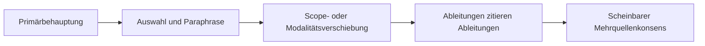

# Transferfall: Quellen-Echo und Referenzrahmen-Drift

**Sprachen:** Deutsch · [English](TRANSFER_CASE_SOURCE_ECHO.en.md)

## Status und Zweck

Dieser Transferfall untersucht, wie mehrere veröffentlichte Texte den Eindruck
mehrfacher Bestätigung erzeugen können, obwohl sie für eine bestimmte
Behauptung auf derselben Evidenzwurzel beruhen. Er trennt außerdem die Zahl der
Quellen von der sprachlichen Treue ihrer Aussagen.

Der Fall ist eine synthetische, nicht-normative Anwendung der RPF. Er erweitert
weder die eingefrorene Kernspezifikation noch den aktuellen JSON-Vertrag. Die
ausführbare Fixture prüft nur, ob eine **deklarierte** Mehrdeutigkeit des
Referenzrahmens erhalten bleibt. Der Validator recherchiert keine Quellen,
vergleicht keine Texte semantisch und erkennt keine Abhängigkeitsgraphen.

## Die Prüfeinheit ist eine Behauptung

Quellenunabhängigkeit ist keine feste Eigenschaft zweier Dokumente. Sie ist
eine Relation bezogen auf eine genau benannte Behauptung `Q` und auf die
betrachtete Evidenzdimension.

Für `Q1` können fünf Texte auf derselben primären Beobachtung beruhen. Für
`Q2` können dieselben Texte eigene Daten, Methoden oder Analysen beitragen.
Deshalb gelten weder „gleiches Thema“ noch „verschiedene Dokumente“ als
ausreichende Unabhängigkeitsprüfung.

| Frage | Mögliche Dimension der Unabhängigkeit |
| --- | --- |
| Wurden neue Beobachtungen erhoben? | Daten |
| Wurde dieselbe Beobachtung neu ausgewertet? | Analyse |
| Wurde eine andere Messmethode verwendet? | Methode |
| Wird nur Hintergrund oder Kontext ergänzt? | Kontext |
| Ist die Aussage aus einem anderen Text abgeleitet? | Provenienz |

Die kompakte Regel lautet:

> Eine Quelle ist nicht „insgesamt unabhängig“, sondern höchstens unabhängig
> **für eine benannte Behauptung und eine benannte Dimension**.

## Drei getrennte Mechanismen

### 1. Quellen-Echo

Mehrere Texte geben dieselbe Behauptung weitgehend treu wieder, gehen für diese
Behauptung aber auf dieselbe Evidenzwurzel zurück. Die Publikationszahl steigt;
die Zahl unabhängiger Beobachtungen nicht.

### 2. Semantische Drift

Die gemeinsame Herkunft ist bekannt, doch beim Auswählen, Kürzen und
Paraphrasieren verändern sich epistemische Merkmale der Behauptung, etwa:

- Möglichkeit wird zu Gewissheit,
- Assoziation wird zu Kausalität,
- eine kleine oder begrenzte Stichprobe wird verallgemeinert,
- Bedingungen, Zeitpunkt oder Restunsicherheit entfallen,
- Beschreibung wird zu Empfehlung, Warnung oder Norm.

### 3. Scheinbarer Konsens

Quellen-Echo und semantische Drift wirken zusammen. Spätere Texte zitieren
Ableitungen statt der Evidenzwurzel und formulieren stärker. Die Wiederholung
erscheint dann zugleich als Bestätigung und als stärkere Aussage.



## Synthetisches Beispiel

Die Fixture verwendet keine reale Sachbehauptung. Ihre fiktive
Evidenzwurzel lautet sinngemäß:

> In einer kleinen explorativen Stichprobe war `X` unter Bedingung `Z` mit `Y`
> assoziiert; Kausalität wurde nicht geprüft.

Eine mögliche Ableitungskette lautet:

1. `X` könnte unter `Z` mit `Y` zusammenhängen.
2. `X` beeinflusst `Y`.
3. `X` verursacht `Y`.
4. Fachleute warnen vor den Folgen von `X`.
5. Mehrere Quellen bestätigen, dass `X` zu `Y` führt.

Die fünf Sätze sind nicht fünf unabhängige Belege. Sie sind auch nicht mehr
dieselbe Behauptung: Modalität, Kausalstatus, Geltungsbereich und normative
Funktion haben sich verschoben.

## RPF-Einordnung

Der Konflikt entsteht nicht nur zwischen „wahr“ und „falsch“, sondern zwischen
mehreren Referenzrahmen:

- **Evidenzursprung:** Wie viele voneinander unabhängige Beobachtungen tragen
  die konkrete Behauptung?
- **sprachliche Modalität:** Wird Möglichkeit, Wahrscheinlichkeit oder
  Gewissheit behauptet?
- **Kausalstatus:** Geht es um Beobachtung, Assoziation oder Ursache?
- **Geltungsbereich:** Für welche Population, Bedingung und Zeit gilt die
  Aussage?
- **kommunikative Funktion:** Wird beschrieben, erklärt, empfohlen oder
  gewarnt?

Damit wird eine scheinbar einfache Frage nach „fünf Quellen“ zu einer
mehrdimensionalen Referenzrahmenprüfung.

## Ausführbare Modellierung und ihre Grenze

Die [Quellen-Echo-Fixture](../examples/source-echo-input-0.2.json) bildet im
unveränderten Eingabevertrag `rpf-validator-input-0.2` nur den bereits
deklarierten Grenzfall ab:

- Eine einzelne synthetische Evidenzwurzel wird als Quelle geführt.
- Fünf abgeleitete Texte werden nicht als fünf Evidenzquellen ausgegeben.
- `C_i` und `C_e` bleiben unquantifiziert; Dokumentzahl wird nicht in einen
  Evidenzwert umgerechnet.
- Der Referenzrahmen bleibt `AMBIGUOUS`, weil Provenienztreue, Modalität,
  Kausalstatus und Geltungsbereich noch nicht maschinenlesbar getrennt sind.
- Die ausgewählte Handlung verfolgt die Zielbehauptung bis zur Wurzel, bevor
  Evidenz aggregiert wird.

Erwartete Regelspur:

```text
overall_status = WARN
A1 = SATISFIED
A2 = SATISFIED
A3 = SATISFIED
A4 = SATISFIED
P1 = SIGNAL    · REFERENCE_FRAME_AMBIGUOUS
P2 = SATISFIED
P3 = NOT_APPLICABLE
P4 = SATISFIED
```

Das `WARN` beweist **nicht**, dass die Texte abhängig oder semantisch verzerrt
sind. Es bestätigt nur, dass die Eingabe den dafür erforderlichen
Referenzrahmen ausdrücklich als mehrdeutig deklariert hat. Auch ein `PASS`
könnte die Wahrheit oder Unabhängigkeit einer Quellenangabe nicht bestätigen.

## Kandidat für einen späteren Provenienzvertrag

Eine echte maschinenlesbare Prüfung benötigt eine neue, versionierte
Vertragserweiterung. Ein möglicher Claim-Datensatz könnte mindestens enthalten:

| Feld | Zweck |
| --- | --- |
| `claim_id` | atomare, vergleichbare Behauptung kennzeichnen |
| `evidence_root_id` | Ursprung der tragenden Beobachtung kennzeichnen |
| `derived_from` | Ableitungs- oder Zitationskante festhalten |
| `dependency_type` | Daten-, Analyse-, Methoden-, Kontext- oder Textabhängigkeit benennen |
| `asserted_by` | verantwortliche Quelle oder Instanz zuordnen |
| `reference_scope` | Population, Bedingung, Ort und Zeit erhalten |
| `epistemic_modality` | Möglichkeit, Wahrscheinlichkeit oder Gewissheit erhalten |
| `causal_status` | Beschreibung, Assoziation oder Kausalbehauptung trennen |

Diese Felder sind ein Architekturvorschlag, kein Bestandteil des aktuellen
Schemas und keine Zusage über die nächste Version. Ein späteres KI-Modul könnte
Claim-Äquivalenz oder Drift als Hypothese vorschlagen. Der deterministische
Validator dürfte diese Hypothese jedoch nur gegen deklarierte und
nachvollziehbare Provenienzdaten prüfen, nicht als Wahrheit voraussetzen.

## Merksätze

```text
Anzahl der Texte ≠ Anzahl unabhängiger Evidenzen
Wiederholung ≠ Bestätigung
ähnliche Formulierung ≠ identische Behauptung
stärkere Formulierung ≠ stärkere Evidenz
```

## Ausführung

Nach lokaler Installation:

```bash
rpf validate examples/source-echo-input-0.2.json
```

Der Befehl endet technisch mit Exit-Code `0`, weil `WARN` ein gültiges
Validator-Ergebnis und kein Eingabefehler ist.

## Forschungskontext und Grenzen

Greenbergs Analyse eines behauptungsspezifischen Zitationsnetzes zeigt, warum
die Untersuchung einer konkreten Behauptung mehr offenlegen kann als bloßes
Zählen von Publikationen. Sumner und Mitautoren untersuchten Veränderungen
zwischen Fachartikeln, Pressemitteilungen und Nachrichten, darunter stärkere
Kausal- und Generalisierungsaussagen. W3C PROV-O stellt allgemeine Begriffe für
Entitäten, Aktivitäten, Agenten und Ableitungsbeziehungen bereit.

- [Greenberg: *How citation distortions create unfounded authority*](https://doi.org/10.1136/bmj.b2680)
- [Sumner et al.: *The association between exaggeration in health related science news and academic press releases*](https://doi.org/10.1136/bmj.g7015)
- [W3C Recommendation: *PROV-O: The PROV Ontology*](https://www.w3.org/TR/prov-o/)

Diese Quellen motivieren die getrennte Betrachtung von Behauptung,
Formulierung und Provenienz. Sie validieren weder RPF noch die vorgeschlagene
Taxonomie oder die synthetische Fixture.
